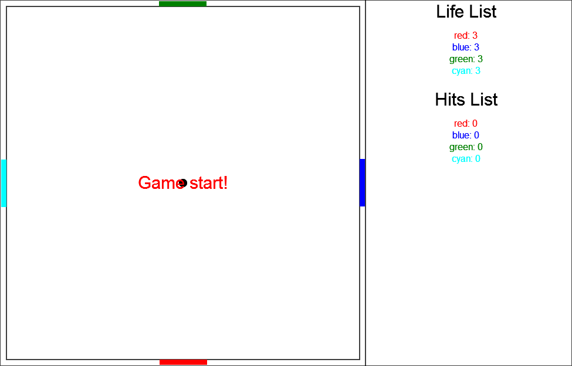
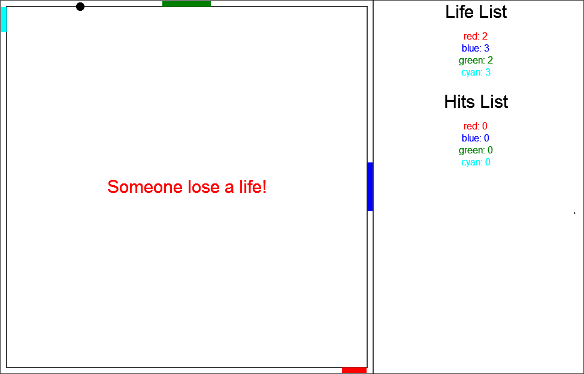
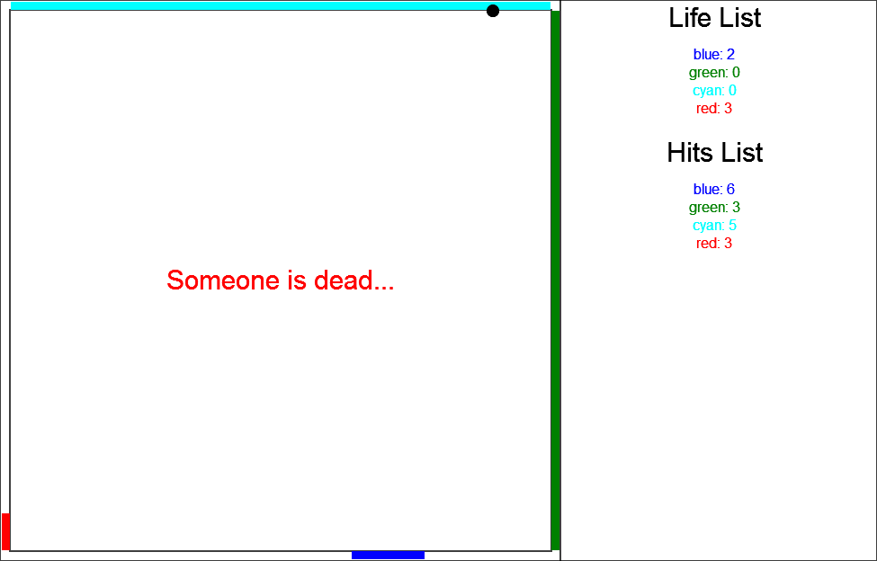
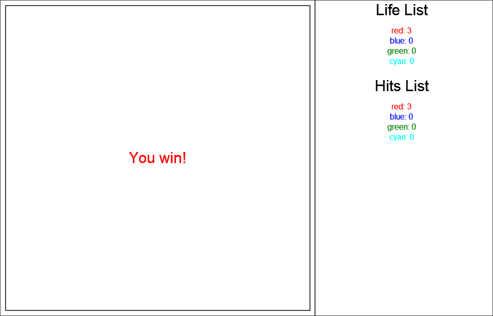
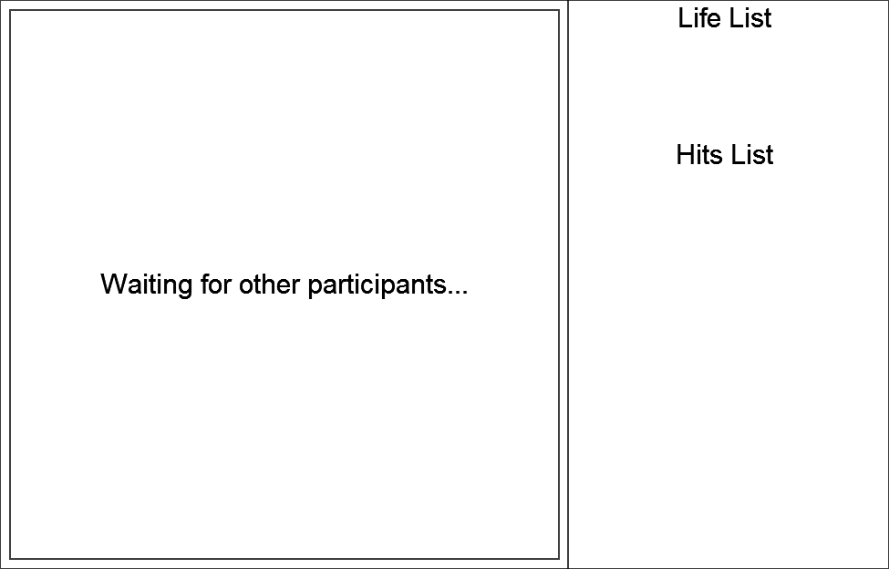

<link href="http://kevinburke.bitbucket.org/markdowncss/markdown.css" rel="stylesheet"></link>

# Marble^4

## Game description

### Introduction
**Marble^4** is an HTML5 game with Node.js server. It seems like one of the earliest arcade video games [*Pong*](http://en.wikipedia.org/wiki/Pong) which is designed by Atari Inc. in 1972. However, this is the 4-player version of the *Pong* game.  

### Basic rules
In this game, everyone has 3 lives, and has a board on one side of the square game area, like this picture:  
  
When the marble reaches one's border and this player doesn't catch the marble with his board, he will lose one life.  
  
As someone lose all his lives, he will be dead and cannot control his board any more.  

### Game control
The board on the below side is yours, and you could control the board by moving your mouse.  
> Note that the reflection angle is only related to the touch point when the marble reach your board.

### Goal
Your goal is to kill all other players and be alive until the end!  

### Join a game
Visit the server IP and port in your browser. When the text below disappear, please wait patiently.  

Learn more in "How to construct a server" section.

## Advanced tips

* Reflection rule: If the marble hits an endpoint of a board, the reflection angle will be 45°. Otherwise, the reflection angle will be always less than 45°. Specially, when the marble hits the center of board, it will reflect vertically.
* When someone is dead, his board will become a "wall", which will fill his border have a mirror reflection effect instead of the previous reflection rule.
* The game will have a 3-second pause when game starts or someone is dead.
* The server is only able to support 4 clients at a time. If you get the "server is full" message, please refresh the webpage after a while.
* When you just finished a game, you could refresh your browser to rejoin the server. There is no need to restart server.

## How to build a server

### Set your IP address

You should modify the first line of client.js:  
`var serverURL         = 'http://localhost';   // URL of server`  
Set your IP address here instead of "localhost". Port is not necessary.

### Run the server

Use `start_server.bat` to run the server.

### Run a client

Just visit the IP address of the server with port 8080!  
> *Internet Explorer* is **NOT** supported! And *Firefox* is **NOT** tested yet. We strongly recommend the *Chrome* browser.
> What's more, it's also recommended to read this *readme* page in *Chrome*, while *Internet Explorer* could not parse the css file correctly.

## Copyright Announcement

The splash screen from this [original link](http://www.flickr.com/photos/oter/4730719419/in/photostream/) by [Jo Christian Oterhals](http://www.flickr.com/photos/oter/). It's published with [CC BY-NC-ND 2.0](http://creativecommons.org/licenses/by-nc-nd/2.0/).
